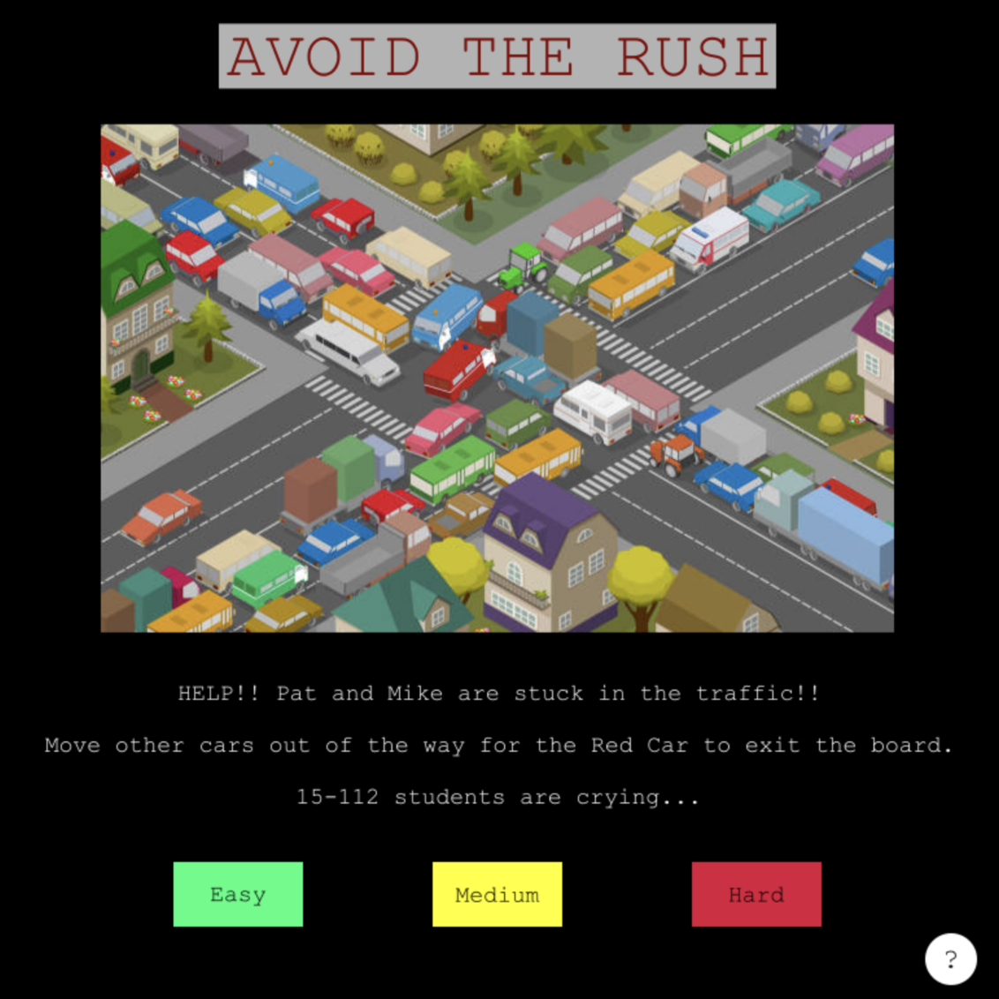

<!-- Improved compatibility of back to top link: See: https://github.com/othneildrew/Best-README-Template/pull/73 -->

<!--
*** Thanks for checking out the Best-README-Template. If you have a suggestion
*** that would make this better, please fork the repo and create a pull request
*** or simply open an issue with the tag "enhancement".
*** Don't forget to give the project a star!
*** Thanks again! Now go create something AMAZING! :D
-->

<!-- PROJECT SHIELDS -->
<!--
*** I'm using markdown "reference style" links for readability.
*** Reference links are enclosed in brackets [ ] instead of parentheses ( ).
*** See the bottom of this document for the declaration of the reference variables
*** for contributors-url, forks-url, etc. This is an optional, concise syntax you may use.
*** https://www.markdownguide.org/basic-syntax/#reference-style-links
-->

<!-- PROJECT LOGO -->
 

  

  <h3 align="center">Avoid The RUSH!</h3>

<!-- ABOUT THE PROJECT -->
## About The Project

[![Product Name Screen Shot][product-screenshot]]

Project Description: 
The goal of "Avoid the Rush" is to move nearby cars, trucks, and buses to free the red car. 
The red car, with Professor Virtue and Taylor, is stuck in traffic.
User can choose the level of difficulty (easy, medium, hard) of the game. 
The red car should reach the exit within the stated number of moves. 

(<a href="#readme-top">back to top</a>)

<!-- GETTING STARTED -->
## Getting Started

Running the Program:
User should run the main.py in order to start our program. 

<!-- CONTACT -->
## Contact

Your Name - [@your_twitter](https://twitter.com/your_username) - email@example.com

Project Link: [https://github.com/your_username/repo_name](https://github.com/your_username/repo_name)

(<a href="#readme-top">back to top</a>)

<!-- ACKNOWLEDGMENTS -->
## Acknowledgments

Created with Lucia (Jeongwon) Han, Jayden (Inhwa) Chang, and Sophie (Sohee) Yoon.

(<a href="#readme-top">back to top</a>)

